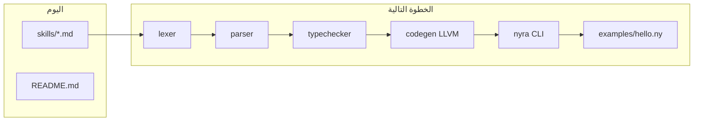

# أين نكمل: Nyra من تصميم إلى لغة شغالة

## الوضع الحالي

| موجود | غير موجود |
|---------|-----------|
| [skills/skill.md](skills/skill.md), [Roadmap.md](skills/Roadmap.md), syntax/errors/typechecker **كـ spec** | أي `.rs`, `Cargo.toml`, `main.ny`, compiler |
| [README.md](README.md) يصف LLVM + CLI | `nyra run` فعلي |

**الخلاصة:** أنتم قريبين من “لغة حقيقية” على مستوى **المواصفات**، وليس التنفيذ. الفجوة الوحيدة = **Phase 1–7 من الـ Roadmap** (compiler skeleton → binary).



---

## ترتيب الأولويات (إجابة مباشرة على الـ 4 نقاط)

1. **أول working compiler** — **ابدأوا هنا.** هذا يحوّل Nyra من repo تسويقي إلى لغة قابلة للتشغيل.
2. **Sample GitHub repo ready** — **بعد** أول `nyra run examples/hello.ny` يطبع `Hello` أو `30`؛ قبلها الـ repo “جاهز للعرض” لكن ليس “جاهز للمصداقية”.
3. **NyraPkg v1** — **مؤجّل صراحةً** ([Roadmap.md](skills/Roadmap.md) Phase 0: package manager خارج MVP). وثّقوا في README “post-MVP” فقط.
4. **Syntax → VM** — **ليس المسار المختار** (اخترتم LLVM من البداية). VM يبقى خيار v0.2+ أو Wasm backend لاحقاً، لا يعطل الـ MVP.

---

## نطاق MVP المُقفل (لا توسّع)

من [skills/Roadmap.md](skills/Roadmap.md) — **فقط:**

- `let` / `mut`, `fn`, `if` / `while`, `return`
- أنواع: `i32`, `bool`, `string` (string كـ literal + `print` أولاً)
- `print`, حساب بسيط, `fn main()`

**خارج النطاق حتى يعمل الـ demo:**

- `module` / imports ([syntaxDesign.md](skills/syntaxDesign.md) كامل)
- ownership / borrow checker (skill.md يذكرها — **مرحلة ما بعد MVP**)
- generics, async, structs/enums, NyraPkg

**Syntax للـ parser الأول:** اتبعوا أمثلة الـ Roadmap (بدون `module`، بدون semicolons إلزامية في الـ MVP إن بقي الـ lexer بسيطاً):

```ny
fn main() {
    let x = 10
    let y = 20
    print(x + y)
}
```

---

## هيكل المستودع المستهدف

مطابق [skills/TypeChecker.md](skills/TypeChecker.md) — workspace Rust واحد:

```
Nyra/
├── Cargo.toml              # workspace
├── cli/               # binary: nyra
│   └── src/main.rs
├── compiler/          # lib
│   └── src/
│       ├── lib.rs
│       ├── lexer/mod.rs
│       ├── parser/mod.rs
│       ├── parser/recovery.rs   # من ErrorRecoveryDesign
│       ├── ast/mod.rs
│       ├── typechecker/mod.rs
│       ├── codegen/llvm.rs
│       └── error/mod.rs         # NyraError + Span من NyraErrorSystemDesign
├── examples/
│   ├── hello.ny
│   └── math.ny
├── tests/                  # integration: nyra run + expected stdout
├── skills/                 # يبقى كما هو
└── README.md               # Quick start حقيقي بعد Phase 7
```

**Dependencies (مقترحة):**

- `inkwell` — LLVM IR من Rust (يتطلب LLVM مثبت على الجهاز: `brew install llvm` على macOS)
- `clap` — CLI
- `thiserror` / `miette` (اختياري) — diagnostics أغنى من `println!` لاحقاً

---

## مراحل التنفيذ (LLVM-first)

### Phase 1 — Skeleton + CLI (أيام 2–5)

- `cargo new` workspace + `nyra run <file.ny>` يقرأ الملف ويطبع placeholder
- تعريف `NyraError`, `Span`, `ErrorReporter` حسب [NyraErrorSystemDesign.md](skills/NyraErrorSystemDesign.md)
- AST enums: `Program`, `Function`, `Statement`, `Expression`, `Literal`, `Op`

### Phase 2 — Lexer (أيام 6–8)

- Keywords: `let`, `mut`, `fn`, `if`, `else`, `while`, `return`, `true`, `false`
- `IDENT`, `NUMBER`, `STRING`, `+ - * / = == != < >`, `{}()`, newlines كـ statement separators
- كل token يحمل `Span` (file + line + column)

### Phase 3 — Parser + recovery (أيام 9–13)

- Pratt أو recursive descent للتعبيرات
- `parse_let`, `parse_fn`, `parse_if`, `parse_while`, blocks
- `consume` + `synchronize` من [ErrorRecoveryDesign.md](skills/ErrorRecoveryDesign.md) — أخطاء متعددة، AST جزئي

### Phase 4 — Type checker (أيام 14–16)

- `Type`, `TypeEnv`, `FunctionSignature` من [TypeChecker.md](skills/TypeChecker.md)
- undefined variable, type mismatch في `+`, توقيع `fn` vs `return`
- `Type::Unknown` + جمع أخطاء؛ لا codegen إذا `has_errors()` (أو codegen آمن فقط لـ `nyra check`)

### Phase 5 — LLVM codegen (أيام 17–22)

- `Codegen` context: module, builder
- `i32` arithmetic, alloca/store/load للـ `let`, branches لـ `if`/`while`
- `print`: declare `printf` external + format string في `.rodata`
- `main` → `i32` return 0

### Phase 6–7 — Link + run (أيام 23–27)

- emit object (`.o`) → link بـ `clang` (subprocess من CLI)
- `nyra run main.ny` = compile + exec + propagate exit code
- **معيار النجاح:** [Roadmap MVP output](skills/Roadmap.md) — `print(x + y)` → `30`

### Phase 8–9 — Repo “جاهز لـ GitHub” (أيام 28–30)

- `nyra build`, `nyra check` (parse + typecheck بدون link)
- `examples/`, `tests/`, CI بسيط (`cargo test` + script يشغّل `nyra run examples/hello.ny`)
- README: متطلبات LLVM، install، hello world
- License (MIT مثلاً) + CONTRIBUTING مختصر

---

## NyraPkg v1 — تصميم فقط (لا تنفيذ في MVP)

عندما يُطلب لاحقاً، وثيقة `docs/nyrapkg-v1.md` تلخّص من [skill.md](skills/skill.md) §9:

- `go.mod`-style: `nyra.mod` + `nyra.sum` lock
- أوامر: `init`, `add`, `build`, `test`
- Git URLs + semver + cache محلي
- **لا تُبنى** قبل وجود `import` في اللغة والـ compiler

---

## مخاطر LLVM (وكيف تتجنبونها)

- **بيئة التطوير:** وثّقوا `LLVM_SYS_180_PREFIX` (أو إصداركم) في README؛ بدون LLVM المشروع لا يبني.
- **تعقيد `string`:** في MVP — `print` لـ int عبر `%d` أولاً؛ string literals في codegen مرحلة ثانية ضمن نفس الـ sprint.
- **لا borrow checker في v0.1:** لا تُؤخّر الـ MVP؛ أضيفوا في README “memory model: planned”.

---

## ماذا يعني “لغة حقيقية شغالة” بعد 30 يوم

| معيار | حالة متوقعة |
|--------|-------------|
| ملف `.ny` → binary native | نعم (LLVM + clang) |
| أخطاء compiler structured | نعم (lexer/parser/type) |
| CLI `nyra run` | نعم |
| Package manager | لا (مخطط) |
| Rust-level memory safety في Nyra | لا (لاحقاً) |

---

## الخطوة الأولى عند الموافقة على الخطة

1. إنشاء workspace Rust + مجلدات `cli` / `compiler`
2. `ast` + `error` + lexer لـ `let x = 10` يدوياً في unit test
3. ثم parser لبرنامج `main` واحد

لا تعديل على [skills/](skills/) إلا إذا أضفتم `docs/` للمواصفات المنفصلة عن الكود.
